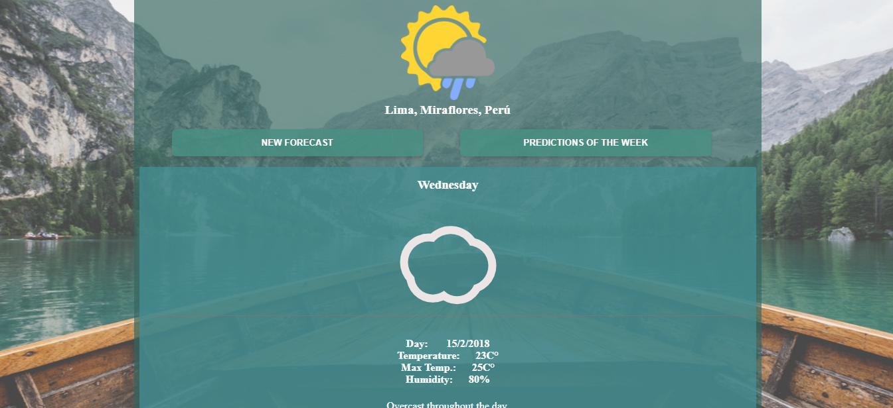
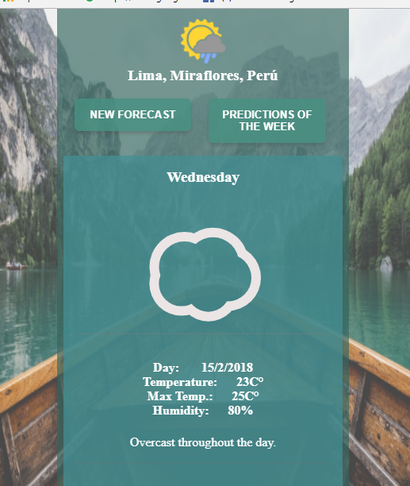

# DARK SKY WEATHER

* **Track:** _ESPECIALIZACION_
* **Curso:** _CONSTRUYE UNA SINGLE PAGE APP (SPA) MULTI-USUARIO CONSUMIENDO DATA REMOTA_
* **Unidad:** _JUGANDO CON WEB APIS_

***

## OBJETIVO

* ¿Has visto que los sistemas operativos móviles vienen con una APP de predicción del clima? ¡Vamos a hacer la nuestra! Para ello, usaremos la API de Dark Sky y esperemos llegues a usar un API de imágenes como Flickr, Unsplash u otro. A continuación te dejamos unos slides con algunos recursos y guías del flujo de la app. Recuerda que no es necesario que sigas el diseño al pie de la letra, eres completamente libre de adaptarlo a tus gustos.

## FLUJO
1. Obtener las **APIKeys** de los Api's a utilizar.

2. Crea un proyecto con sus archivos HTML, CSS y JS.

3. Inicializamos el servidor **node**.

4. Instalamos las depencia de **express**.

5. Creamos la carpeta **server.js**, donde iniciaremos nuestro servidor con Express.

6. A partir de este punto empezamos a crear nuestras estructura principal **index.html**,donde colocaremos los input para obtener las coordenadas del lugar que queremos.

7. Mediante el Api de **Google Maps** obtenemos la latitud y altitud de lugar que deseamos.

8. Con el Api de **Dark Sky Weather** obtenemos la temperatura actual ,la temperatura máxima,el porcentaje de humedad y una pequeña descripcion del clima.Tambien tenemos la opcion de ver la temperatura que se tendrá en el resto de la semana.

9. Utilizando el Api de **Unplash** obtendremos imagenes aleatorias que serán colocadas como fondo de la página,en este caso utilizando la cátegoria de naturaleza.

## DEMO

## RECURSOS

* Html,css,Javascript,
* Node,
* Express (dependencia),
* gitignore,
* Api Google maps,
* Api Dark sky Weather,
* Api Unsplash.

## Integrantes(GitHub)

* [LAURA JIMENEZ](https://github.com/LauraJH16)
* [MARINA RODRIGUEZ](https://github.com/MarinaRH)
* [MELINA PERNIAS](https://github.com/MelinaPernia)